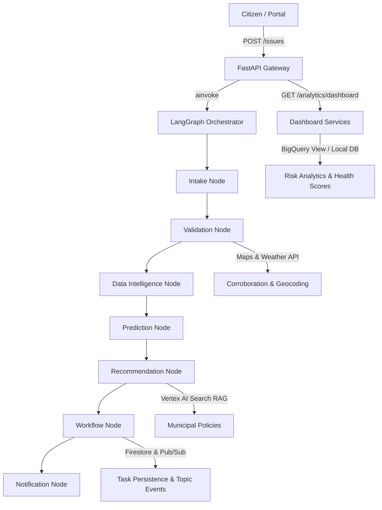

# Sampark AI Platform

Sampark AI is a state-of-the-art Community Decision Intelligence Platform. It leverages a multi-agent LangGraph pipeline, Vertex AI Search (RAG), Firestore, and BigQuery to process citizen issue reports, perform risk assessments, determine optimal resolution recommendations, and dispatch task workflows.

---

## 🏗️ System Architecture



---

## 💻 Local Development Setup

Follow these steps to set up the backend and frontend services locally.

### 1. Backend Setup

1. **Install Dependencies**:
   Initialize development mode package bindings and linting/testing suites:
   ```bash
   pip install -e ".[dev]"
   ```

2. **Configure Environment Variables**:
   Create a `.env` file in the root directory based on `.env.example`:
   ```bash
   # Agent Keys & Configuration
   GEMINI_API_KEY=your_gemini_api_key_here
   GOOGLE_MAPS_API_KEY=your_google_maps_api_key_here
   OPENWEATHER_API_KEY=your_openweather_api_key_here
   
   # Google Cloud Settings
   GCP_PROJECT_ID=sampark-genapac
   BIGQUERY_DATASET=sampark_dataset
   APP_MODE=local  # Runs in-memory local DB fallback if set to 'local'
   ```

### 2. Frontend Setup

The frontend is a gorgeous Vite-powered React client application built with custom glassmorphism styling.

```bash
cd frontend
npm install
```

---

## 🧪 Running Tests

Validate the application backend, LangGraph node transitions, persistence layers, and gateway endpoints:

```bash
python -m pytest
```

This will run all units and the comprehensive end-to-end integration test suite (`backend/tests/test_e2e.py`).

---

## 🚀 Running the Platform Locally

### Option A: One-Command Start (Windows)
Run the launcher script from the root directory:
```bash
start-demo.bat
```
This automatically verifies dependencies, launches the FastAPI backend and React Vite frontend in separate console windows, and opens your browser.

### Option B: Manual Execution
Ensure both services are running concurrently to test the complete flow:

1. **Start Backend API Gateway**:
   ```bash
   uvicorn backend.main:app --reload --port 8000
   ```
   *The API docs will be available at `http://localhost:8000/docs`.*

2. **Start Frontend Client**:
   ```bash
   cd frontend
   npm run dev
   ```
   *Open `http://localhost:5173` in your browser.*

For a detailed interactive guide, refer to the [demo.md](file:///d:/Genapac/Sampark_GENAPAC/demo.md) guide.


## 🕹️ Interactive Demo Walkthrough

Once the platform is running locally, follow these steps to experience the complete workflow:

### 1. Authentication
- Open `http://localhost:5173` in your browser.
- **Officer Login**: Use username `admin` and password `password`.
- **Leader Login**: Use username `leader_w1` and password `password`.

### 2. Citizen Issue Report Portal
- Go to the **Report Issue** tab.
- Enter a description of a municipal complaint (e.g., *"Large water leak on the main road in Ward 1 causing road degradation."*).
- Select a Ward ID and click **Submit to Decision Engine**.
- **Real-Time Agent Progress**: An EventSource SSE stream (`/chat/stream/{session_id}`) will display node execution checkpoints (e.g. `Intake Node`, `Validation Node`, `Workflow Node`) as they complete.
- **Decision Results**: When processing completes, you will see:
  - Generated **Session ID** and **Issue ID**.
  - **Assigned Department** (e.g., *Water Supply Department*).
  - **Validation Confidence Score** (e.g., *95%*).
  - **Next Recommended Action** (RAG grounded recommendation).
  - **Citizen-facing NLP Message** formulated by response nodes.

### 3. Officer Decision Intelligence Dashboard
- Go to the **Dashboard** tab.
- Monitor metrics like the **Community Health Score** and count of **Critical Open Tasks**.
- See **Geospatial Risk Levels** per ward visualized on risk score bars.
- Inspect the **Critical Action List** showing priority tasks.
- **Real-Time Push Alerts**: Keep multiple tabs open and file new reports in one. The dashboard in the other tab will receive push notifications via SSE stream (`/analytics/dashboard/stream`) of new task creations and status updates within 5 seconds.

### 4. Knowledge Base Administration
- Go to the **Knowledge Base** tab (visible to Admin/Officer).
- Upload PDF policy acts (max 50MB) to index them into Vertex AI Search.
- View and manage embedded policy documents with cascaded index deletion support.

---

## ☁️ Production Deployment Guide

Deploy the application to Google Cloud Run only after verifying local demo behavior.

### 1. Build and Run Containers (Docker)
Build multi-stage production-ready containers:
```bash
# Build Backend
docker build -t gcr.io/sampark-genapac/backend:latest ./backend

# Build Frontend (Nginx SPA proxy)
docker build -t gcr.io/sampark-genapac/frontend:latest ./frontend
```

### 2. Cloud Run Deploy
```bash
gcloud run deploy sampark-backend \
  --image gcr.io/sampark-genapac/backend:latest \
  --platform managed \
  --region us-central1 \
  --set-env-vars APP_MODE=production

gcloud run deploy sampark-frontend \
  --image gcr.io/sampark-genapac/frontend:latest \
  --platform managed \
  --region us-central1
```

### 3. Terraform Infrastructure
Provision project-level resources (BigQuery, Firestore, GCS buckets, Pub/Sub topics) securely:
```bash
cd infra/terraform
terraform init
terraform plan
terraform apply
```
